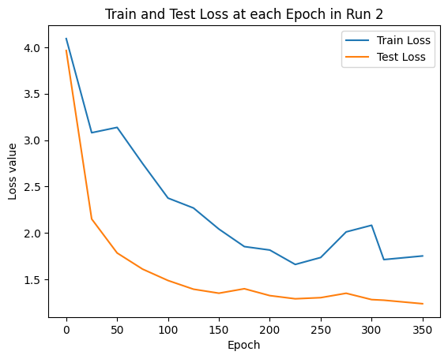
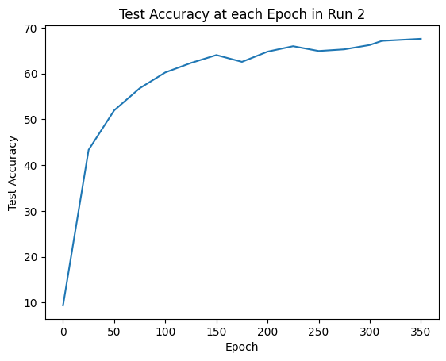

This is my implementation of the Vision Transformer project based on the paper "An Image is worth 16x16 words": https://arxiv.org/pdf/2010.11929

My implementation is **from scratch**, with Encoder, Transformer, MLP, and Patch Embedding implemented from base Pytorch modules. My model is in the models folder. 
I will test and train my model on the CIFAR100 dataset which can be found in the "dataset" folder. 

ViT from scratch on CIFAR-100 dataset usually results in about 55% accuracy after 100 epoch. The reason for the lower accuracy is due to the relatively small dataset and high computation power of ViTs. With each run, I will attempt to improve fine tuning to attempt increasing base accuracy.

To train the transformer, run the following command in the root directory (load model left blank for new train):
python train.py --config config.yaml --load-model 'model path'

To test, run the following command in the root directory (load model required):
python test.py --config config.yaml --load-model 'model path'

Baseline Run: Training on 100 epochs on the dataset with model parameters in logs/checkpoint_100.pth.
Training Loss = 0.1621, and testing loss is 2.4870 and testing accuracy is 55.10% 
Results indicate that the model is over fitting the dataset (low training loss, high testing loss). Need either data augmentation, regularization, or model improvements. 

Run 2: Increased Data Augmentation for smaller dataset training and increased dropout rate (0.1 to 0.2), increased epochs

 

While Train Loss consistently decreased with epochs, test loss began to stagnant at around 100 epoch. Test accuracy consistently improved with each epoch with a logarithmic behavior. Further epoch training might see limited improvement with current parameters. Test accuracy increased from 55.1% in baseline run to 65.65%, which is significant improvement and is in the competitive range for ViT on CIFAR-100 from scratch. At epoch=100, test accuracy was 61.69%, which shows the effectiveness of the changes at the same epoch length. 

Run 3: Learning Rate Scheduling and Label Smoothing, further increased epochs
 

Run 3 resulted in slightly higher losses and lower accuracy in early training, but showed a slight improvement in test accuracy of 65.96% at 250 epochs. Further training up to 350 epochs resulted in an increased final accuracy of 67.57%.

Adding label smoothing impacted performance of early training epochs, but yielded only a slight increase in accuracy compared to Run 2. The increase of accuracy with more epochs cannot be definitively associated with the changes in Run 3, as increased epoch in Run 2 could have resulted in similar outcome. Test accuracy still increased logarithmically and can likely be increased further at the cost of exponentially increasing training time. 

